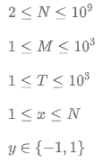
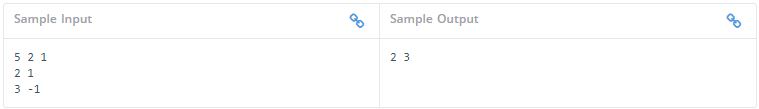

# Ants on a circle

## Problem
In a country X, all the ants move in a circle. 
There is a circle marked with  marks with N numbers from 1 to N clockwise. 
There are M ants on the circle. 
No two ants stand on the same mark initially. 
It is also known in which direction each ant will move. 
If two ants meet during the movement, then each of them begins to move in a different direction. 
Your task is to determine where the ants will be after T seconds of such movement.

### Input format
1) The first line contains the numbers N,M,T.
2) The following M lines have the following format:
3) Each line contains two numbers x and y. 
   The first number of this line x is the position of the ant, the second number of this line y is the direction
   in which the ant moves. Here,y=1, if the ant starts to move clockwise and y=1 if counterclockwise. 
   The distances between adjacent marks are the same. In one second, the ant overcomes a distance equal 
   to the distance between adjacent marks on the circle.

### Output format
In the first line, print M integers in ascending order denoting the positions 
where the ants will be in  seconds after such obsessive moves.

#### Constraints

